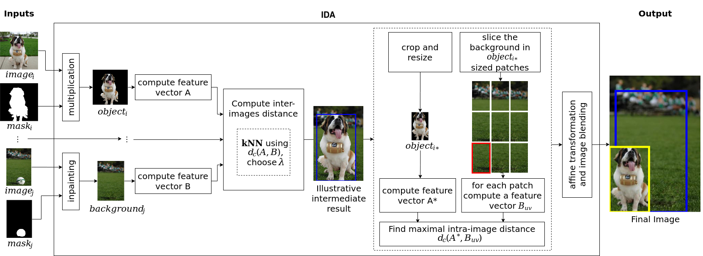

# IDA: Improved Data Augmentation Applied to Salient Object Detection
Our previous method is available at https://github.com/VRI-UFPR/ANDA

<p align="center">

</p>

## Getting started
Since this repository use a submodule to clone it we recommend running:

```
git clone --recurse-submodules https://github.com/ruizvitor/IDA.git
```

## Requirements

We recommend the use of conda alternatively miniconda for python environment management. Run the create_env.sh script for the necessary environments.

[The Res2Net-PoolNet]((https://github.com/Res2Net/Res2Net-PoolNet.git)) is only necessary if you wish to replicate the experiments performed on our paper.


## Pretrained models
For the pretrained models of DeepFillv2 check [DeepFillv2 Official Code](https://github.com/JiahuiYu/generative_inpainting)


## STEP BY STEP USAGE:

You can use your own dataset but as an example we suggest running the following example

- Download the DUTS Training Dataset at [http://saliencydetection.net/duts/download/DUTS-TR.zip](http://saliencydetection.net/duts/download/DUTS-TR.zip)
- (Optional) Download the DUTS Test Dataset at [http://saliencydetection.net/duts/download/DUTS-TE.zip](http://saliencydetection.net/duts/download/DUTS-TE.zip)

- Install conda or miniconda 
- run the bash script ```bash run.sh``` 

-The script is intended as an example of all the steps required. It will download the duts-tr dataset extract, prepare the folders, create the path file mapping paths_input_mask_output.txt and paths_input_mask.txt, create the two conda environments genInpaint and ida and install the necessary packages in each. It will check if you have the pretrained model for the DeepFillv2, if you already downloaded it and put it in generative_inpainting/model_logs the script will procceed and generate the Inpainted images for the duts-tr dataset at DUTS-TR/DUTS-TR-Inpainted, the the computeKnn.py will run, which accepts input parametrization, the computation of the features will take a while and the proper background_mapping will be created at generate_samples. Finally the ida.py will run and the created samples will be available at generate_samples/output/


- you can run ```python generate_samples/computeKnn.py --help```  to check the input parameterization.
- you can run ```python generate_samples/ida.py --help``` to check the input parameterization.

## Special thanks
We would like to thank the authors of Generative Image Inpainting with Contextual Attention for the code of DeepFillv2 used in our work and the authors of Res2Net: A New Multi-scale Backbone Architecture for the Res2Net-PoolNet implementation.

## Citing
If you found this code useful for your research, please cite:

```
```


## DISCLAIMER:
This is a research code, so compatibility issues might happen.
This repository contain the following submodule: [DeepFillv2 Official Code](https://github.com/JiahuiYu/generative_inpainting)
